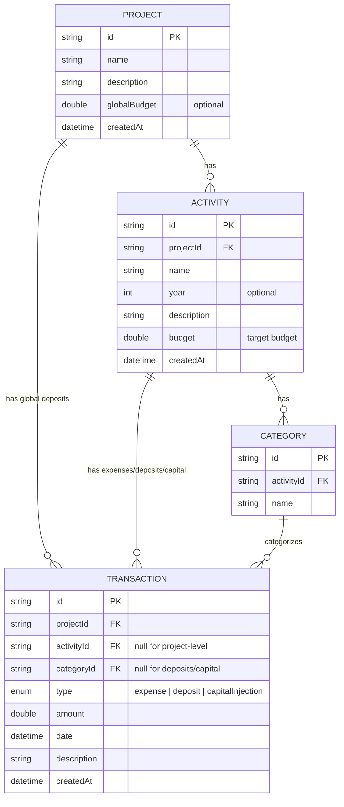

# My Investments App — Implementation Plan

## Goal

Build a personal investment tracking app where the user can:
- Create **projects** (e.g., "Inversión en Palma")
- Add **activities/phases** per project with optional budgets (e.g., "Siembra 2025", "Siembra 2026", "Terreno")
- Categorize expenses within activities (e.g., "Compra de palma", "Preparación del terreno")
- Record **transactions** (expenses, deposits, capital injections with dates, amounts, descriptions — including installments)
- Register **deposits** toward a project or activity budget
- Register **capital injections** (owner financing) at project or activity level
- Track budget progress: how much is budgeted, deposited, spent, and remaining

The app must work across all screen sizes (mobile, tablet, desktop) using shadcn_flutter.

---

## Data Model



### Budget Calculations

| Metric | Formula |
|--------|---------|
| **Activity Spent** | Sum of expenses where `activityId == activity.id` |
| **Activity Deposited** | Sum of deposits where `activityId == activity.id` |
| **Activity Remaining** | `activity.budget - activityDeposited` |
| **Activity Balance** | `activityDeposited - activitySpent` |
| **Activity Capital Injected** | Sum of `capitalInjection` where `activityId == activity.id` |
| **Activity Net Balance** | `activityBalance + activityCapitalInjected` |
| **Project Spent** | Sum of ALL expenses in the project |
| **Project Deposited** | Sum of ALL deposits (global + activity-level) |
| **Project Budget** | `globalBudget` if set, otherwise sum of all activity budgets |
| **Project Capital Injected** | Sum of ALL `capitalInjection` in the project |
| **Project Operating Balance** | `projectDeposited - projectSpent` |
| **Project Net Balance** | `projectOperatingBalance + projectCapitalInjected` |

---

## Architecture (Screaming)

```
lib/
├── main.dart
├── app/
│   ├── app.dart                      # ShadApp root + MultiBlocProvider
│   └── router.dart                   # Simple page routing
│
├── core/
│   ├── theme/
│   │   └── app_theme.dart            # shadcn theme config
│   ├── storage/
│   │   └── local_storage.dart        # JSON file-based storage abstraction
│   ├── extensions/
│   │   └── currency_ext.dart         # Number formatting (currency)
│   └── widgets/
│       ├── responsive_layout.dart    # LayoutBuilder wrapper
│       ├── stat_card.dart            # Reusable stat card widget
│       └── empty_state.dart          # Empty state placeholder
│
└── projects/                         # 🔊 Single module — the app IS about projects
    ├── domain/
    │   └── entities/
    │       ├── project.dart
    │       ├── activity.dart
    │       ├── category.dart
    │       └── transaction.dart
    │
    ├── data/
    │   ├── models/
    │   │   ├── project_model.dart    # Entity + JSON serialization
    │   │   ├── activity_model.dart
    │   │   ├── category_model.dart
    │   │   └── transaction_model.dart
    │   ├── datasources/
    │   │   └── projects_local_ds.dart
    │   └── repositories/
    │       └── projects_repository_impl.dart
    │
    └── presentation/
        ├── bloc/
        │   ├── projects_cubit.dart       # List/CRUD projects
        │   ├── projects_state.dart
        │   ├── project_detail_cubit.dart  # Single project detail + activities
        │   └── project_detail_state.dart
        ├── pages/
        │   ├── projects_page.dart         # List of projects
        │   ├── project_detail_page.dart   # Project overview + activities
        │   └── activity_detail_page.dart  # Activity: categories, transactions, budget
        └── widgets/
            ├── project_card.dart          # Project summary card
            ├── activity_card.dart         # Activity summary card
            ├── transaction_tile.dart      # Single transaction row
            ├── budget_progress.dart       # Budget progress bar/indicator
            ├── add_project_dialog.dart    # Create/edit project form
            ├── add_activity_dialog.dart   # Create/edit activity form
            ├── add_transaction_dialog.dart # Add expense/deposit form
            └── add_category_dialog.dart   # Add category form
```

### Pragmatic Decisions

> [!NOTE]
> - **No use cases layer** for now — cubits call the repository directly. Use cases can be added later when business logic grows.
> - **Models double as entities** — `ProjectModel` extends/implements `Project` entity and adds `toJson`/`fromJson`. Keeps things DRY for a local-only app.
> - **Single repository** — `ProjectsRepository` handles all CRUD for projects, activities, categories, and transactions since they're tightly coupled.

---

## Local Storage

Using `shared_preferences` with JSON serialization. Data stored as JSON arrays under these keys:
- `projects` → `List<ProjectModel>`
- `activities` → `List<ActivityModel>`
- `categories` → `List<CategoryModel>`
- `transactions` → `List<TransactionModel>`

> [!IMPORTANT]
> This is an MVP storage strategy. If data grows significantly, we can migrate to `sqflite` or `hive` later. The repository abstraction makes this swap trivial.

---

## Pages & UI

### 1. Projects Page (Home)
- Grid/List of project cards with summary stats (total budget, total spent, deposited)
- FAB or button to create a new project
- **shadcn components**: `Card`, `PrimaryButton`, `Badge`, responsive grid via `LayoutBuilder`

### 2. Project Detail Page
- Header with project name, description, and dynamic budget stats using `LayoutBuilder` (at least 2 metrics per row for optimal mobile reading)
- **Top Metrics**: Depositado | Gastado | Balance Operativo | Capital Inyectado | Balance Neto | Presupuesto 
- **Last Transactions**: unified list of latest project-level transactions (expenses, deposits, capital)
- **Activities**: List of activity cards with individual budget progress
- Buttons to manage categories, and add activities.
- **shadcn components**: `Card`, `Table`, `PrimaryButton`, `Badge`, progress indicators

### 3. Activity Detail Page
- Header with activity name, year, budget progress bar
- **Top Metrics**: Depositado | Gastado | Balance Operativo | Capital Inyectado | Balance Neto (Dynamic Grid via `LayoutBuilder`)
- **Transactions section**: Unified table/list of all transactions (expenses, deposits, capital)
- **Categories section**: Manage categories for this activity
- Buttons to add transactions, and manage categories
- **shadcn components**: `Table`, `Card`, `Dialog` for forms, `Select` for category filter

### Forms (Dialogs)
All forms use shadcn `Dialog` with shadcn form components:
- **Add/Edit Project**: name, description, global budget
- **Add/Edit Activity**: name, year, description, budget
- **Add Category**: name
- **Add Transaction**: type (expense/deposit/capitalInjection), amount, date, description, category (only for expenses)

---

## Responsive Layout Strategy

```
┌─────────────────────────────────────────────────┐
│  Mobile (< 600px)     │  Desktop (≥ 600px)      │
├───────────────────────┼─────────────────────────┤
│  Bottom navigation    │  Sidebar / NavigationRail│
│  Single column cards  │  Grid cards (2-3 cols)  │
│  Full-screen dialogs  │  Centered dialogs       │
│  Stacked stats        │  Horizontal stats row   │
└───────────────────────┴─────────────────────────┘
```

Using `LayoutBuilder` + breakpoints to adapt layouts.

---

## User Review Required

> [!IMPORTANT]
> **Language**: User-facing strings will be in **Spanish** as specified in the rules. Code stays in English.

> [!IMPORTANT]
> **Scope**: This plan covers MVP with local persistence only. No authentication, no cloud sync, no multi-currency support.

---

## Open Questions

1. **Currency**: Should amounts be displayed in a specific currency format? (e.g., USD `$1,234.56` or COP `$1.234.567`?)
2. **Categories**: Should categories be shared across activities within a project, or unique per activity?
3. **Recurring expenses**: You mentioned "gasto recurrente" — should there be a recurring transaction feature, or is manually registering each transaction enough for now?

---

## Verification Plan

### Automated
- `flutter analyze` — no warnings
- `flutter build web` — builds successfully
- Run the app with `flutter run -d chrome` and verify all screens

### Manual (Browser)
- Create a project, add activities, categories, transactions, deposits, capital injections
- Verify budget calculations are correct
- Verify responsive layout on mobile and desktop sizes
- Verify data persists after page reload
